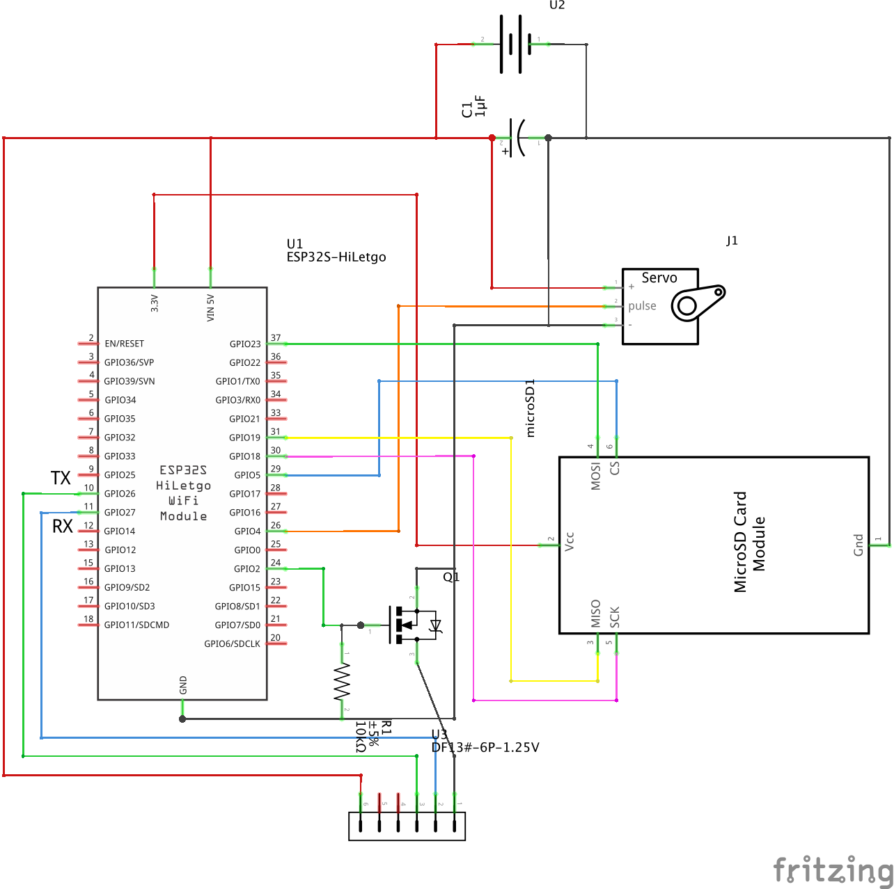

# 3Scan
3Scan is a three dimensional LIDAR scanner.

## Serial Commands

All commands have to be send via serial and terminated with a `\n`.

```bash
// list settings
CMD:LST

// update serial transfer
CMD:SET:ST:1
CMD:SET:ST:0

// start scan
CMD:START

// stop scan
CMD:STOP
```

## Hardware
Based on ESP32 and Sweep Scanse LIDAR.



*Hardware Scheme*